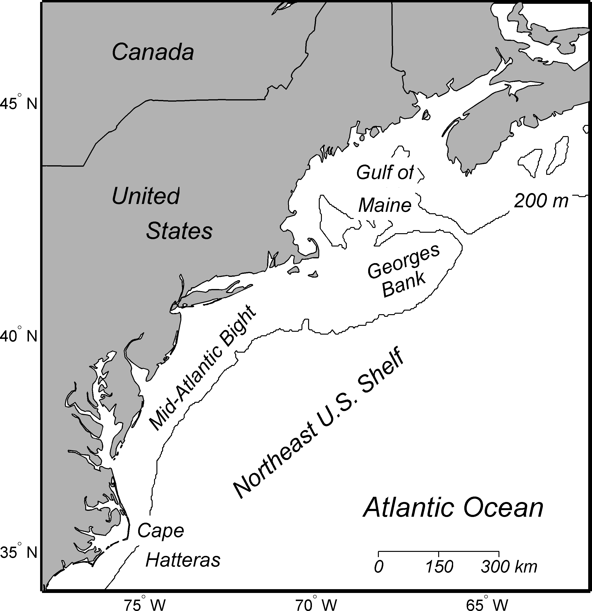

# Introduction {-}

The purpose of this document is to house information about the indicators that are developed and used for integrated ecosystem assessment on the Northeast Shelf Large Marine Ecosystem by the Ecosystem Dynamics and Assessment Branch at the Northeast Fisheries Science Center (see figure, below). Many of the pages included in this document expand upon the indicators that are featured in the State of the Ecosystem reports produced for the Mid-Atlantic and New England regions.

The information included in this document is contributed by a large variety of collaborators and contact information is available in each chapter. When possible, provided data is available in `ecodata`, an R package that holds the latest version of the data available. 

The metadata for each indicator (in accordance with the [Public Access to Research Results (PARR) directive](http://obamawhitehouse.archives.gov/sites/default/files/microsites/ostp/ostp_public_access_memo_2013.pdf)) are described in the subsequent chapters, with each chapter title corresponding to an indicator or analysis. The methods used to develop each indicator can be found in the Technical Documentation ([tech-doc](https://noaa-edab.github.io/tech-doc/)).


```{r setup, echo=FALSE, message = FALSE, warning = FALSE}
knitr::opts_chunk$set(echo = F,
                      message = F,
                      warning = F)

#shadedRegion <- c(2013,2022)

 library(magrittr)
 library(dplyr)
 library(sf)


```

(ref:neusmap) Map of Northeast U.S. Continental Shelf Large Marine Ecosystem from @hare_vulnerability_2016

```{r neusmap, message = FALSE, warning=FALSE, fig.align='center',out.width="75%", echo = F, fig.cap='(ref:neusmap)'}


```


